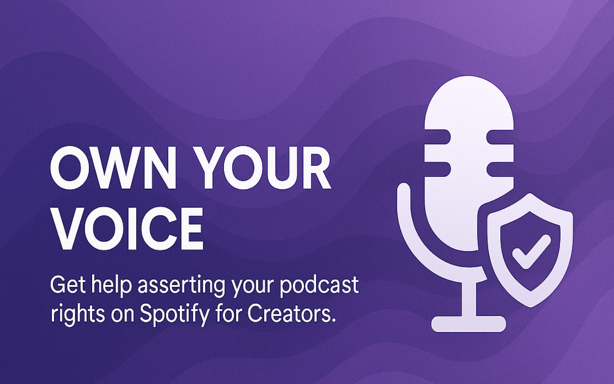
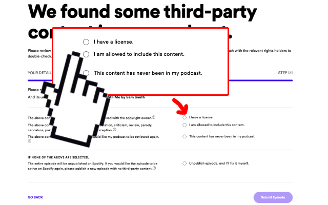

# Spotify Assertion of Rights Helper 🎧

A Chrome extension that automatically fills in your preferred response to Spotify's "Assertion of Rights" questions for podcast creators.

## 🚀 What it does

This extension helps podcast creators save time by automatically selecting your preferred response when Spotify asks you to assert your rights for podcast content. No more repetitive clicking through the same options every time!

## ✨ Features

- Automatically selects your preferred response on the Assertion of Rights page
- Simple options menu to set your default choice
- Works on the official Spotify for Creators platform
- Speeds up your workflow when managing multiple podcast episodes

## 🔧 Installation

1. Download or clone this repository
2. In Chrome, go to [`chrome://extensions/`](chrome://extensions/)
3. Enable "Developer mode" in the top right
4. Click "Load unpacked" and select the extension folder

## 🛠️ Usage

1. After installing, click the extension icon and select "Options"
2. Choose your default assertion response
3. Visit the [Spotify Assertion of Rights page](https://podcaster-assertion-of-rights.spotify.com/)
4. The extension will automatically select your preferred option

## 🔒 Privacy

This extension:
- Only runs on the Spotify Assertion of Rights page
- Only stores your preference locally in your browser
- Doesn't collect any data or send information anywhere

## 📝 License

MIT

## 👨‍💻 Author

Created by [jeroenpeters1986](mailto:jeroenpeters1986@gmail.com)